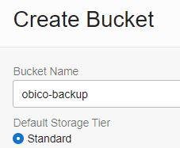
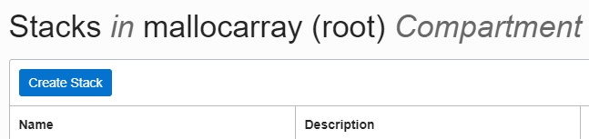
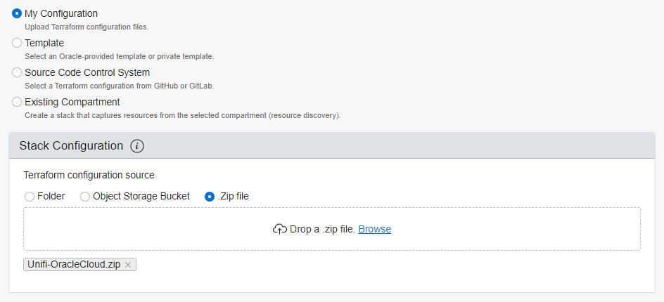
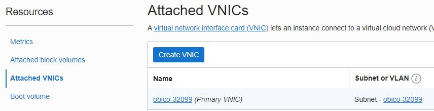
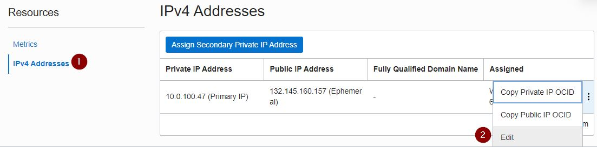
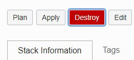

# Obico on Oracle Cloud Infrastructure with Free Tier

Obico (formerly The Spaghetti Detective) is an amazing project using AI and Deep Learning to monitor a webcam observing your 3D printer and can pause prints if things look to be failing.
[https://www.obico.io/](https://www.obico.io/)

Obico is a paid service, but is also open source and able to be installed as a self-hosted docker container with instructions found here:

[https://www.obico.io/docs/server-guides/](https://www.obico.io/docs/server-guides/)

This does require more powerful hardware than a Raspberry Pi, so you need either a PC to leave powered on any time you are printing, or purchase separate hardware such as nVidia Jetson Nano.

Oracle Cloud Infrastructure (OCI) offers "Oracle Cloud Free Tier" which includes Always Free cloud services, including ARM-based Ampere VMs equivalent to 4 CPU cores and 24 GB RAM, which is more than sufficient to run an Obico instance with no charge and no expiration date. (Credit card required for registration)

[https://www.oracle.com/cloud/free/](https://www.oracle.com/cloud/free/)

OCI uses "stacks" that automates the provisioning of an environment using Terraform.  Using only a single zip file, Obico can be provisioned quickly with very little interaction.

This project contains a zip file that can be used with Oracle Cloud to create a free VM instance that will automatically install Obico and optionally backup and restore the database to an Oracle Bucket so upgrades can become as easy as running a Destroy then Apply on the existing Stack

## Configuration

1) Download the .zip file.
2) Register an account on Oracle Cloud or login to your existing account

   - Register: [https://www.oracle.com/cloud/free/](https://www.oracle.com/cloud/free/) (Credit card required for registration)
   - Login: [https://cloud.oracle.com/](https://cloud.oracle.com/)
3) Navigate to Menu>Storage>Object Storage & Archive>Buckets>Create Bucket. Give the bucket a name, such as "obico-backup". This will be used to store a backup of the configuration database outside of the VM Instance. All default options are acceptable, but "Enable Object Versioning" may be desirable.

   
4) Navigate to the Menu>Developer Services>Resource Manager>Stacks
5) Click "Create Stack"

   
6) Leave the default option of "My Configuration". Change the "Terraform configuration source" to ".Zip file", then drag or Browse the zip file to the Stack Configuration section. Provide a name for the stack if desired or keep the auto-generated name.  Leave the default Terraform version as 1.2.x then click Next

   
7) Review the variables and modify if needed. Click 'Next', then 'Create'

   - Enter/verify the Availability Domain number in the list of variables.
   - Enter the name of the storage bucket created earlier
   - Defaults to an Ampere ARM based instance (VM.Standard.A1.Flex)
   - It is highly recommended to enter your public IP address in the source_ip field, so only your home IP can access the instance.  You can find the IP by going to [https://www.whatismyip.com/](https://www.whatismyip.com/) and copying the Public IPv4 address.  Enter it followed by /32 such as 100.110.120.123/32
8) On the final Create page, check the box to "Run Apply"

   - Alternatively, in the list of Stacks, click on the name of the newly created Stack.  Click on **Apply** followed by Apply.
9) In a few minutes, the Stacks job will complete and show the public IP address and URL to access the controller. It may take 15 minutes or more to complete the installation of the software.

   - If the process encounters an error stating "shape VM.Standard.A1.Flex not found", verify the Availability Domain that is Always Free Eligible for your region, or try a different number 1-3.
   - If the process encounters an error stating "Out of host capacity", your Region does not currently have available resources for Always Free instances. In the Oracle Forums regarding this error, they recommend trying again later as capacity is always being added. You can also upgrade to "Pay As You Go" (PAYG) which makes the Ampere instances much more available, and as long as you stay under the Free Tier limits, continues to be free.
     [Managing Account Upgrades and Payment Method](https://docs.oracle.com/en-us/iaas/Content/Billing/Tasks/changingpaymentmethod.htm)
10) Open the URL to the web interface and login.
    If using a DNS name, update the entry to reflect the new IP address, or consider a Dynamic DNS service such as [http://www.duckdns.org](http://www.duckdns.org) to automatically update when provisioned
11) Follow the rest of the documentation steps from the official project to complete the server, Octoprint, and mobile app

    [https://github.com/TheSpaghettiDetective/obico-server#server-configuration](https://github.com/TheSpaghettiDetective/obico-server#server-configuration)

    [https://www.obico.io/docs/server-guides/configure/](https://www.obico.io/docs/server-guides/configure/)

**Note**: When navigating around the Oracle interface, make sure to change the Compartment option on the left side to "obico" by default to view the newly created objects. To view the Stacks, change the Compartment back to root

## Information

The zip file contains one or more .tf files with Terraform instructions.  These configure the following:

- Container for all of the newly created objects
- Virtual Cloud Network
- Subnet
- Route Table
- Internet Gateway
- Network Security Groups with required ports for Obico
- Computer Instance sized for Always Free running an Ampere ARM based VM

## SSH Access to Instance

To enable SSH to the Instance, follow the Oracle guide on [Managing Key Pair on Linux Instances](https://docs.cloud.oracle.com/iaas/Content/Compute/Tasks/managingkeypairs.htm?Highlight=ssh)

Paste the public key into the "ssh_public_key" variable when Applying the stack.  If the Instance already exists, Edit the Stack configuration to modify the Variables, then run a Destroy followed by Apply, which will remove your current instance and create a new one with the SSH key included.  If the backup process has run on Sunday morning, the latest data will be restored.

Additional information can be found on the Oracle Support Page under [Instance Console Connections](https://docs.cloud.oracle.com/iaas/Content/Compute/References/serialconsole.htm)

## Static IP Reservation

A static IP address can be reserved to keep the same address even if the original instance is deleted or recreated.  This is not done automatically by the Terraform file, but can configured after creation

1) Navigate to Menu>Compute>Instances and select the Obico instance name. (Ensure Compartment on the left side is changed to "obico")
2) Scroll down to "Attached VNICs" under Resources on the left side and click on the Primary VNIC name

   
3) Scroll down to "IPv4 Addresses" under Resources on the left side and click the "..." icon to the far right and select Edit

   
4) Change **Public IP Type** to "No Public IP" and click Update. Then click Edit again and select **Reserved Public IP** and "Create a New Reserved Public IP" or select a previously created entry. Click Update.

## Deleting or re-creating an instance

Instances created using Stacks can easily be destroyed to remove all associated items and optionally recreate them

1) Navigate to Menu>Resource Manager>Stacks and select the previously used Stack name
2) Select **Destroy**.  Confirm by clicking Destroy again.

   

Once completed, return to Stacks to use the Apply option to create a new instance with the original configuration. It is not necessary to **Delete Stack** unless the stack configuration is changing.

If a bucket was defined in the variables, the stack will attempt to restore a copy of the configuration database to the new instance as it starts up

**Note** If a Reserved IP address as assigned to the Instance, it will need to be removed from the VM prior to Destroying the stack. Since it was not created as part of the Stack, it will not be removed when Destroying the stack.

## Network Security

As mentioned above, it is highly recommended to configure the static_ip field in the Stack variables so traffic will only be allowed from your home IP.  This does prevent remote monitoring from other IPs such as a mobile device, since the IP will constantly be changing.  Consider a VPN from a mobile device to your home network if this is important.  At this time, configuring HTTPS for a self-hosted option is not part of this stack configuration

If using Edge, if the "Secure Network" feature is enabled, it will use a VPN for the site since it is not secure by default, and your IP will be different from what is entered in the "source_ip" variable.  In the Edge settings, configure Secure Network to never be used for your Oracle instances IP

## Backup and Restore

The scripts created automatically will backup only the .env and db.sqlite3 files, which are enough to retain any printer registrations and customizations to e-mail or push notifications, but will not backup the timelapse videos.  Backups are scheduled for Sunday at 1:00 am or can be executed manually by remotely connecting to the instance via SSH and running

```bash
cd /obico-server/
sudo ./obico-backup.sh
```

To edit the backup schedule using cron, use the commend

```bash
sudo crontab -e
```

## Upgrading

If you have configured SSH keys, connect to the instance and run the commands specified on the Github page, using sudo in front of each 'git' and 'docker-compose' lines

```bash
cd obico-server
sudo git checkout release
sudo git pull
sudo docker-compose up --build -d
```

[https://www.obico.io/docs/server-guides/ops/#upgrade-obico-server](https://www.obico.io/docs/server-guides/ops/#upgrade-obico-server)

If you have not setup SSH, go to the Stacks menu mentioned above, select your stack for Obico and run the `Destroy` command to remove the current instance and then `Apply` to recreate the instance with the latest version and restoring from your last backup

### Unarchive a Printer

Self-Hosted servers are not able to view archived printers, as that code is in a separate private repo, but printers can be un-archived by connecting to the db container and issuing the command

```bash
sudo apt install sqlite3
cd /obico-server
sqlite3 backend/db.sqlite3
UPDATE app_printer SET archived_at = NULL;
.exit
```

## Removing timelapse list

After a rebuild and restore of the database file, the old timelapse videos will no longer be present on the server, but references in the database will still be present.

Connecting to the db file with `sqlite3` and running the following command will remove all existing timelapse entries

```bash
sudo apt install sqlite3
cd /obico-server
sqlite3 backend/db.sqlite3
UPDATE app_print SET video_url = NULL, tagged_video_url = NULL, poster_url = NULL;
.exit
```
